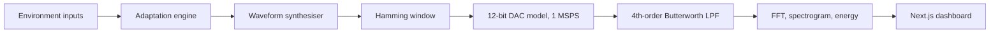

# AdaptiPing

> A software-defined sonar transmitter that adapts its pulse to the water, so an AUV spends energy only where it buys range or resolution.

<p>
  <a href="backend/app/data/presets.py"><strong>Presets</strong></a>
  ·
  <a href="#hardware-transition">Hardware mapping</a>
  ·
  <a href="#run-it-locally">Run locally</a>
</p>


## The idea

An AUV's sonar usually transmits fixed settings chosen before the dive. In muddy water a high frequency is absorbed and scattered. In clear water a low frequency wastes resolution, and a long, loud pulse drains the battery either way. AdaptiPing reads the conditions, picks a band, pulse length and drive level from a small set of presets, synthesises the waveform, and shows the result on an engineering dashboard before any hardware exists.

Built for Smart India Hackathon 2026, Problem Statement **SIH26058** (Ministry of Earth Sciences, Hardware, Robotics and Drones): *Development of a Low-Power, Real-Time Adaptive Software-Defined Sonar Transmitter Payload for AUVs.*

## What you can explore

| Page | Demonstrates |
| --- | --- |
| Dashboard | Environment inputs, the adaptive decision and its explanation |
| Environment | Turbidity, depth, salinity, temperature and battery controls |
| Waveforms | LFM, geometric sweep and Barker-13 pulses, with time-domain trace, FFT up to 500 kHz and an STFT spectrogram |
| Hardware | Target blocks, simulated health and energy per ping |
| History | Log of past transmissions and the settings used |

## Presets

| Preset | Band | Pulse | Amplitude* | Why |
| --- | --- | --- | --- | --- |
| Muddy Estuary | 90–130 kHz | 2.0 ms | 1.00 | Lower band scatters less; longer pulse recovers energy |
| Mid Turbidity | 120–160 kHz | 1.2 ms | 0.75 | Balance of range and resolution |
| Clear Shallow Reef | 150–200 kHz | 0.6 ms | 0.50 | Clear water allows high frequency and a short, cheap pulse |

\*Amplitude is relative to full scale. Below 20 % battery, duration is capped at 0.8 ms and amplitude at 0.40.

## Architecture



The adaptation engine is deterministic: fixed, readable rules, no trained model, so every decision can be explained and audited. The dashboard falls back to a browser-side copy of the same logic if the backend is unreachable.

## Current status

Everything on the dashboard comes from simulation: the adaptation logic, the waveform and the DAC and filter models. No sonar hardware has been measured yet. The physical prototype is in fabrication for the national round, and bench oscilloscope and FFT captures will replace the simulated plots.

## Hardware transition

Each software module maps to one block of the planned STM32G4 payload:

| Software | Hardware |
| --- | --- |
| `adaptation.py` | Firmware decision loop reading the ADC |
| `waveform.py` | Precomputed lookup tables in flash, windowed in advance |
| DAC model | 12-bit DAC driven by a timer and DMA at 1 MSPS |
| Butterworth model | Fixed 4th-order op-amp low-pass filter at 224 kHz, then a buffer |
| `energy.py` | Current-sense measurement of energy per ping |
| Dashboard | Ground-station monitor |

## Run it locally

```bash
# Backend
cd backend
python -m venv venv && source venv/bin/activate   # Windows: .\venv\Scripts\activate
pip install -r requirements.txt
python -m uvicorn app.main:app --host 127.0.0.1 --port 8000

# Frontend (second terminal, project root)
cp .env.example .env.local
npm install
npm run dev
```

The dashboard opens at `http://localhost:3000` and the API docs at `http://127.0.0.1:8000/docs`.

Verify the project:

```bash
python -m pytest backend/app/tests -v
npx tsc --noEmit
npm run lint
```

The backend suite covers adaptation rules, Nyquist rejection, windowing, DAC quantisation, FFT, the spectrogram and the REST contract.

## Roadmap

- [x] Deterministic adaptation engine with three presets
- [x] LFM, geometric and Barker-13 synthesis with windowing
- [x] DAC and filter models, FFT, spectrogram and energy estimate
- [x] FastAPI backend, Next.js dashboard and offline fallback
- [ ] STM32G4 firmware: timer and DMA streaming to the DAC
- [ ] Bench oscilloscope and FFT validation of the filter output
- [ ] Drive stage and transducer in water

## Safety

Limits on the API are deliberate: pulses are capped at 50 ms, sample rate at 2 MSPS and output at 100,000 samples. CORS allows local origins only, and errors return structured messages with no stack traces. This project does not claim to model underwater acoustic propagation or echo processing.

## License

Educational and technical-evaluation prototype for SIH 2026.
