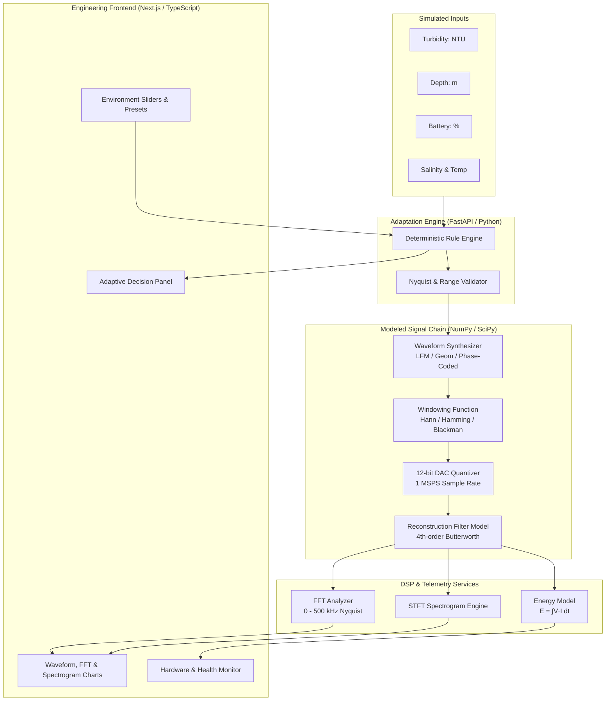

# AdaptiPing

### Energy-Constrained Adaptive Sonar Transmitter for Autonomous Underwater Vehicles

> **Current Implementation Status:**  
> **Software Simulation / Engineering Prototype.**  
> **Physical sonar hardware is not yet implemented.**

AdaptiPing is an engineering prototype and software simulation of a compact, adaptive sonar transmitter payload concept designed for Autonomous Underwater Vehicles (AUVs). Built for the Smart India Hackathon (SIH 2026) Problem Statement **SIH26058** (*Ministry of Earth Sciences / National Institute of Ocean Technology*), the system models environmental sensing inputs, deterministic adaptation of acoustic transmit parameters, software-defined waveform synthesis, DAC and analog-chain behavior, spectral analysis (FFT and spectrogram), and electrical energy-per-ping estimation monitored via a technical web dashboard.

---

## Project Status

**Status:** Software Simulation / Engineering Prototype  
**Bench Target Platform (Model):** STMicroelectronics STM32G474 (ARM Cortex-M4F)

### What Is Implemented
- **Deterministic Adaptive Control Logic:** Rule-based parameter selection based on turbidity, depth, temperature, salinity, and remaining payload battery state.
- **Waveform Synthesis Pipeline:** 
  - Linear Frequency Modulation (LFM) up-chirp with continuous phase calculation.
  - Geometric (exponential) frequency sweeps.
  - Phase-coded pulses (Barker-13 code with BPSK modulation).
- **Spectral Windowing:** Configurable Hann, Hamming, and Blackman tapering windows to minimize spectral leakage and sidelobes.
- **Hardware-Chain Modeling:**
  - 12-bit DAC quantization over 4096 discrete steps at a simulated $1\text{ MSPS}$ rate ($500\text{ kHz}$ Nyquist limit).
  - Modeled 4th-order active Butterworth reconstruction low-pass filter ($f_c = 300\text{ kHz}$).
- **Spectral & Energy Analysis:**
  - Fast Fourier Transform (FFT) with normalized frequency response up to Nyquist ($500\text{ kHz}$).
  - Short-Time Fourier Transform (STFT) spectrogram visualizing chirp progression over time.
  - Model-based electrical energy-per-ping numerical integration ($E = \int V(t) \cdot I(t) \, dt$).
- **Dual-Tier Architecture:**
  - **Backend:** FastAPI (Python 3.14 / NumPy / SciPy / Pydantic v2) REST API with strict CORS and schema validation.
  - **Frontend:** Next.js 16 (React 19 / TypeScript / Tailwind CSS / Recharts) engineering dashboard.
- **Client Offline Fallback:** Browser-side deterministic simulation fallback when backend connectivity is interrupted.
- **Automated Verification:** 33 automated unit and integration tests (pytest), strict TypeScript type checking, and ESLint coverage.

### What Is Not Yet Implemented (Hardware Transition Roadmap)
- Physical STM32G4 microcontroller hardware execution.
- Physical high-speed DAC silicon and SPI/DMA driver firmware.
- Physical analog driver stage, power amplifier (Class-AB/D), and impedance matching transformer.
- Physical piezoelectric (PZT) acoustic transducer submerged in water.
- Live physical environmental sensors (CTD or optical turbidity probes).
- Real UART/USB serial telemetry streams from embedded hardware.
- Bench oscilloscope or spectrum analyzer physical measurements.
- Real underwater acoustic propagation and target echo processing.

---

## The Engineering Problem

Autonomous Underwater Vehicles operate under severe size, weight, and power (SWaP) constraints. In conventional sonar payload architectures, acoustic transmit settings are often statically configured prior to deployment. This creates unavoidable operational trade-offs:

1. **Acoustic Attenuation vs. Resolution:** Higher acoustic frequencies (e.g., $150\text{--}200\text{ kHz}$) provide fine spatial resolution but suffer high volumetric absorption and scattering in turbid, particulate-heavy water. Lower frequencies (e.g., $90\text{--}130\text{ kHz}$) penetrate murky columns but sacrifice range resolution.
2. **Pulse Energy vs. Power Budget:** Longer pulse durations and higher amplitudes increase transmitted pulse energy and signal-to-noise ratio (SNR), but rapidly deplete battery reserves, shortening AUV mission duration.
3. **Environmental Dynamics:** Estuarine and coastal waters present rapid shifts in turbidity (0–100 NTU), salinity, and thermal layering. A fixed-parameter transmitter cannot dynamically adapt its pulse profile to maintain optimal acoustic performance within battery constraints.

AdaptiPing models an intelligent software-defined transmitter payload that programmatically optimizes pulse duration, center frequency, chirp bandwidth, and output drive level to environmental conditions while strictly respecting energy constraints.

> *Note: This project models the transmitter-side decision logic and bench analog chain. It does not claim experimental validation of full underwater acoustic channel propagation.*

---

## Core Operational Idea

```
Environment Inputs (Depth, Turbidity, Temp, Salinity) + Battery Level
                           ↓
               Deterministic Adaptation Engine
     (Selects band, pulse duration, amplitude, modulation)
                           ↓
              Software Waveform Generator (LFM / Geom / Barker)
                           ↓
             12-bit DAC Quantization Model (1 MSPS)
                           ↓
          4th-Order Butterworth Reconstruction LPF Model
                           ↓
          Spectral Analysis (FFT & Spectrogram) + Energy Estimation
                           ↓
               Engineering Monitoring Dashboard
```

The adaptation engine uses deterministic, transparent rules rather than black-box machine learning models, ensuring predictable, auditable behavior required for embedded marine robotics.

---

## System Architecture



---

## Engineering Conventions & Unit Contracts

To prevent unit ambiguity, AdaptiPing adheres to strict architectural boundaries:

| Quantity | Internal Python / Math Layer | Backend REST API Responses | Dashboard Display |
| :--- | :--- | :--- | :--- |
| **Frequency** | Hertz ($\text{Hz}$) e.g., $90000.0\text{ Hz}$ | Dual fields (`start_frequency_hz: 90000`, `start_frequency_khz: 90.0`) | Kilohertz ($\text{kHz}$) e.g., **$90\text{ kHz}$** |
| **Bandwidth** | Hertz ($\text{Hz}$) e.g., $40000.0\text{ Hz}$ | Dual fields (`bandwidth_hz: 40000`, `bandwidth_khz: 40.0`) | Kilohertz ($\text{kHz}$) e.g., **$40\text{ kHz}$** |
| **Pulse Duration** | Milliseconds ($\text{ms}$) e.g., $2.0\text{ ms}$ | `duration_ms: 2.0` | Milliseconds ($\text{ms}$) e.g., **$2.0\text{ ms}$** |
| **Sample Rate** | Hertz ($\text{Hz}$) default $1,000,000.0\text{ Hz}$ | `sample_rate_hz: 1000000.0` | Kilohertz ($\text{kHz}$) e.g., **$1000\text{ kHz}$ ($1\text{ MSPS}$)** |
| **Nyquist Limit** | Hertz ($\text{Hz}$) $500,000.0\text{ Hz}$ | Enforced via schema validation ($f_{stop} < f_s / 2$) | Axis scale $0\text{--}500\text{ kHz}$ |
| **Amplitude** | Normalized scalar ($0.0\text{--}1.0$) | `amplitude: 1.0` | Scalar e.g., **$1.00$** |
| **Energy** | Millijoules ($\text{mJ}$) | `energy_per_ping_mj: 0.22` | Millijoules ($\text{mJ}$) e.g., **$0.22\text{ mJ}$** |

### Verified Demonstration Presets

| Preset Name | Environment Condition | Selected Band | Bandwidth | Pulse Duration | Amplitude | Primary Engineering Rationale |
| :--- | :--- | :--- | :--- | :--- | :--- | :--- |
| **Simulated Muddy Estuary** | Turbidity: 80 NTU, Depth: 8 m, Battery: 72% | **$90\text{--}130\text{ kHz}$** | $40\text{ kHz}$ | $2.0\text{ ms}$ | $1.00$ | Lower band minimizes acoustic scattering; extended pulse increases pulse energy. |
| **Simulated Mid Turbidity** | Turbidity: 45 NTU, Depth: 20 m, Battery: 72% | **$120\text{--}160\text{ kHz}$** | $40\text{ kHz}$ | $1.2\text{ ms}$ | $0.75$ | Balanced intermediate band optimizing range versus spatial resolution. |
| **Simulated Clear Shallow Reef** | Turbidity: 12 NTU, Depth: 10 m, Battery: 72% | **$150\text{--}200\text{ kHz}$** | $50\text{ kHz}$ | $0.6\text{ ms}$ | $0.50$ | High frequency maximizes spatial resolution; low turbidity has lower attenuation. |
| **Energy Constrained (< 20%)** | Low battery cutoff activated | Set by turbidity | Preset BW | $\le 0.8\text{ ms}$ | $\le 0.40$ | Transmit amplitude and duration restricted to protect vehicle power reserves. |

---

## Repository Structure

```
AdaptiPing/
├── .env.example                 # Root frontend environment example
├── .gitignore                   # Clean ignore rules (Node, Python, Caches, OS)
├── package.json                 # Next.js frontend package manifest
├── package-lock.json            # Deterministic dependency lock
├── tsconfig.json                # TypeScript compiler configuration
├── README.md                    # Project documentation
│
├── backend/                     # FastAPI Simulation Backend
│   ├── .env.example             # Optional backend environment overrides
│   ├── requirements.txt         # Python dependencies (FastAPI, NumPy, SciPy, pytest)
│   └── app/
│       ├── __init__.py
│       ├── main.py              # FastAPI app instance, CORS & error handlers
│       ├── config.py            # Settings (1 MSPS DAC rate, resource boundaries)
│       ├── api/                 # REST endpoints
│       │   ├── routes_environment.py # Environment state updates
│       │   ├── routes_hardware.py    # Hardware status & health
│       │   ├── routes_health.py      # Liveness probe
│       │   ├── routes_history.py     # History log retrieval
│       │   ├── routes_ping.py        # Ping trigger & inspection
│       │   └── routes_waveform.py    # Waveform synthesis & generation
│       ├── models/              # Pydantic v2 schemas & Nyquist validators
│       │   ├── environment.py   # Telemetry models & ranges
│       │   ├── ping.py          # Ping configuration & unit converters
│       │   └── telemetry.py     # System state & health schemas
│       ├── services/            # Numerical simulation & DSP algorithms
│       │   ├── adaptation.py    # Deterministic adaptation logic
│       │   ├── energy.py        # Numerical integration energy model
│       │   ├── simulation.py    # In-memory bench simulation state
│       │   ├── spectrum.py      # FFT and STFT spectrogram engine
│       │   └── waveform.py      # LFM, Geometric, Barker generator & DAC model
│       ├── data/
│       │   └── presets.py       # Demonstration set-points & hardware models
│       └── tests/               # Automated test suite (33 tests)
│           ├── test_adaptation.py
│           ├── test_api.py
│           └── test_waveform.py
│
├── src/                         # Next.js Frontend Application
│   ├── app/                     # App Router pages
│   │   ├── page.tsx             # Main Monitoring Dashboard
│   │   ├── layout.tsx           # Government/research engineering shell
│   │   ├── globals.css          # Design system tokens & panel styles
│   │   ├── environment/         # Dedicated environment control page
│   │   ├── waveforms/           # Dedicated waveform synthesis & spectral viewer
│   │   ├── hardware/            # Target architecture & hardware status page
│   │   └── history/             # Historical transmission log
│   ├── components/              # Modular UI components
│   │   ├── charts/              # Recharts (TimeDomain, FFT, Spectrogram)
│   │   ├── environment/         # Environment slider controls
│   │   ├── hardware/            # Component tables & health monitor
│   │   ├── layout/              # Header, navigation, status bar
│   │   ├── ping/                # Ping decision card & explanation lines
│   │   ├── status/              # Status badge & indicator cards
│   │   └── waveform/            # Waveform synthesis configuration controls
│   └── lib/                     # Client services & offline fallback
│       ├── adaptation/          # Client-side deterministic adaptation mirror
│       ├── api/                 # Fetch client with auto kHz unit normalization
│       ├── data/                # Client preset defaults
│       ├── simulation/          # Client waveform generator fallback
│       └── types/               # TypeScript interface contracts
└── public/                      # Static assets
```

---

## Quickstart & Installation

### Prerequisites
- **Node.js:** v18.18+ or v20+ (`node -v`)
- **Python:** v3.10+ (`python --version`)
- **Git**

### 1. Clone the Repository
```bash
git clone https://github.com/your-username/adaptiping.git
cd adaptiping
```

### 2. Configure Environment Variables
Copy the provided `.env.example` templates:
```bash
# Frontend environment
cp .env.example .env.local

# Backend environment (optional)
cp backend/.env.example backend/.env
```

### 3. Backend Setup (FastAPI)
```bash
# Navigate to backend directory
cd backend

# Create and activate a Python virtual environment
python -m venv venv
# On Windows:
.\venv\Scripts\activate
# On Linux/macOS:
source venv/bin/activate

# Install required packages
pip install -r requirements.txt

# Start the simulation server
python -m uvicorn app.main:app --host 127.0.0.1 --port 8000
```
The FastAPI backend will start at `http://127.0.0.1:8000`. API documentation is available at `http://127.0.0.1:8000/docs`.

### 4. Frontend Setup (Next.js)
In a separate terminal:
```bash
# From the project root
npm install

# Start development server
npm run dev
```
Open [http://localhost:3000](http://localhost:3000) in your browser.

---

## Running Automated Tests

### Backend Unit & Integration Tests (pytest)
Runs 33 automated tests validating adaptation rules, Nyquist rejection, windowing, DAC quantization, FFT, spectrogram calculation, and REST API contracts:
```bash
python -m pytest backend/app/tests -v
```

### Frontend TypeScript Verification
Verifies strict type safety across all components and API schemas:
```bash
npx tsc --noEmit
```

### Frontend Linting
Verifies code quality and Next.js / React best practices:
```bash
npm run lint
```

### Production Build Validation
Validates that all routes compile and optimize cleanly for production:
```bash
npm run build
```

---

## Hardware Transition Roadmap

When transitioning from this bench software prototype to embedded target hardware, the software modules are designed to map directly to physical hardware blocks:

```
[ Software Prototype Service ]         →   [ Physical Embedded Target Component ]
──────────────────────────────────────────────────────────────────────────────────────────
Adaptation Engine (adaptation.py)      →   STM32G474 Firmware Decision Loop (C / FreeRTOS)
Waveform Synthesizer (waveform.py)     →   Lookup Table (LUT) / DDS Algorithm in Flash
Windowing Functions                    →   Pre-scaled DMA Buffer in STM32 SRAM
DAC Quantization Model (1 MSPS)        →   STM32G4 12-bit DAC1 Triggered by TIM1 via DMA
Butterworth LPF Model                  →   Hardware Sallen-Key 4th-Order Active Low-Pass Filter
Energy Model (energy.py)               →   INA219 / INA226 High-Side I2C Current & Power Shunt
Health & Telemetry API                 →   UART / USB CDC Telemetry Link to AUV Mission Controller
Monitoring Dashboard (Next.js)         →   AUV Topsides Ground Station / Mission Monitoring Portal
```

---

## Security & Reliability Design

- **Strict CORS:** Configured explicitly for local origins (`http://localhost:3000`, `http://127.0.0.1:3000`). No wildcard `*` permissions.
- **Resource Protection:** Duration is constrained to $\le 50\text{ ms}$, sample rate to $\le 2\text{ MSPS}$, and maximum synthesized samples to $100,000$ points to prevent memory exhaustion.
- **Defensive Error Handling:** Custom Pydantic exception handlers return clean, structured error descriptions without exposing backend stack traces or host paths.
- **Offline Resilience:** If backend communication is lost, the frontend displays an offline banner and automatically activates client-side simulation logic so testing can proceed uninterrupted.

---

## SIH 2026 Problem Statement Reference

- **Problem Statement ID:** SIH26058
- **Title:** Development of a Low-Power, Real-Time Adaptive Software-Defined Sonar Transmitter Payload for Autonomous Underwater Vehicles (AUVs)
- **Organization:** Ministry of Earth Sciences (MoES)
- **Department:** National Institute of Ocean Technology (NIOT)
- **Theme:** Robotics and Drones / Hardware

---

## License

This project is developed for educational, research, and technical evaluation purposes under the SIH 2026 framework.
